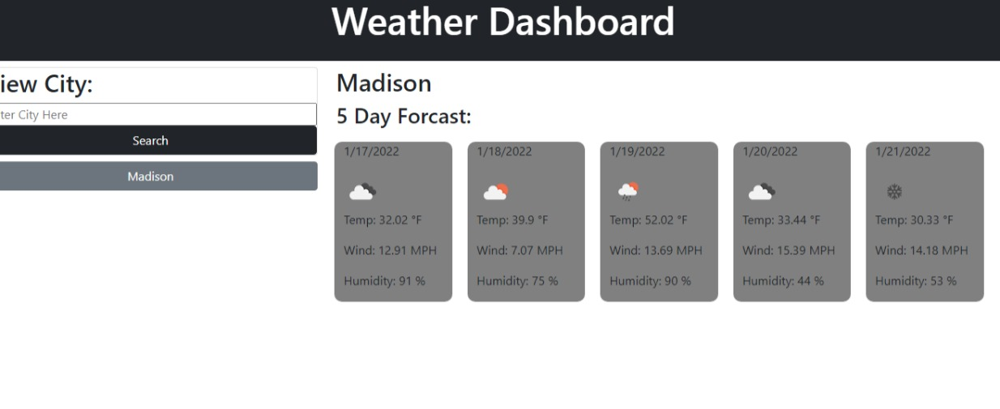

<h1>Openweather 5 Day Forecast</h2>

<h2>Description</h2>

The purpose of this application was to create a website that when you search the name of a city the corresponding city would generate 5 cards of which would give you the weather for the next 5 days.

<h2>Screenshot of Application</h2>

<h2>Contributors</h2>

Chris McLeod

<h2>Languages used</h2>

html

css

javascript

<h2>libraries used</h2>

jquery

bootstrap

Openweather Api

<h2>Github Link</h2>
https://github.com/Chris-McLeod2/WeatherAPI.git
<h2>Deployable Link</h2>
https://chris-mcleod2.github.io/WeatherAPI/